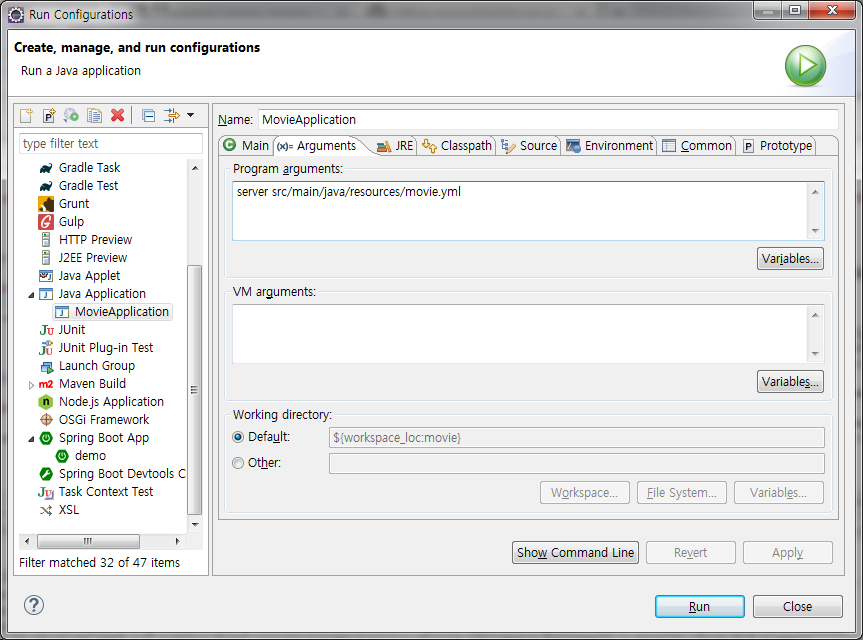

# movie
dropwizard microsevice

I choosed postgresql as database
I've tested this endpoint service with postman

# endpoint restapi list
- GET     /movie (jh.yoo.project.movie.resource.MovieResource) **get movie list**
- POST    /movie (jh.yoo.project.movie.resource.MovieResource) **create movie**
- PUT     /movie (jh.yoo.project.movie.resource.MovieResource) **update movie**
- GET     /movie/actor/{actor} (jh.yoo.project.movie.resource.MovieResource) **filter actor**
- GET     /movie/duration/{duration} (jh.yoo.project.movie.resource.MovieResource) **filter duration**
- GET     /movie/release/{releaseYear} (jh.yoo.project.movie.resource.MovieResource) **filter releaseYear**
- DELETE  /movie/{id} (jh.yoo.project.movie.resource.MovieResource) **delete movie**
- GET     /movie/{id} (jh.yoo.project.movie.resource.MovieResource) **get movie by id**

# Run application in eclipse tool

